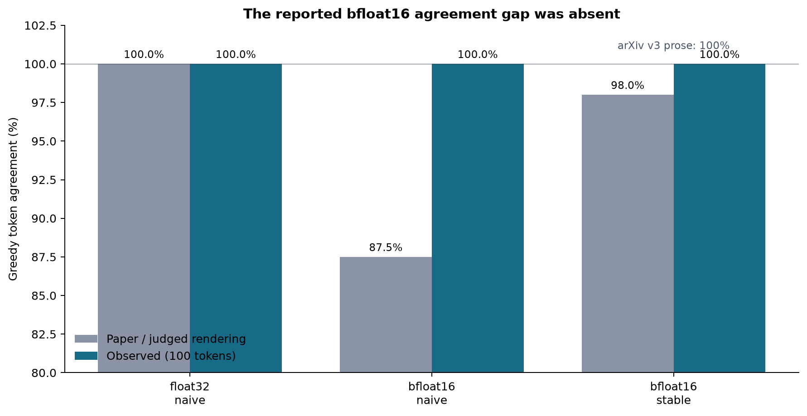
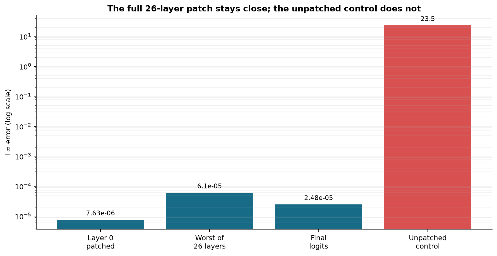
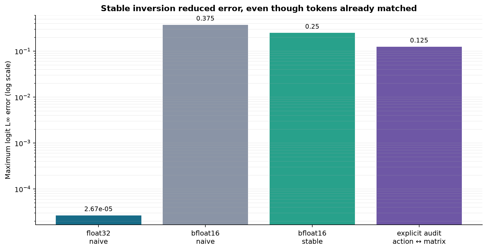
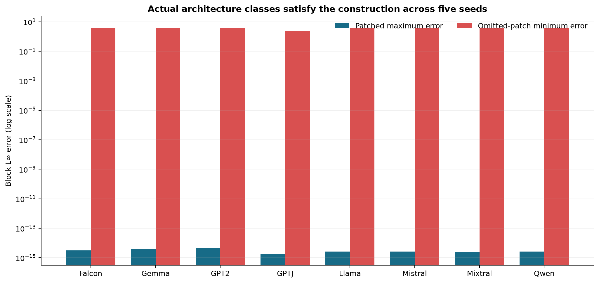
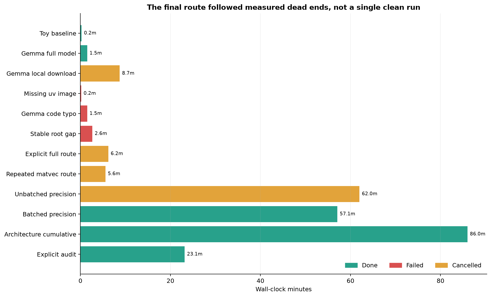

# Context can be compiled into weights—but the reported bfloat16 gap did not reproduce



**Headline evidence.** On the exact Gemma 3 1B weights and the paper's five
prompts, float32, naive bfloat16, and stable bfloat16 patches each matched
100/100 greedy tokens. This directly differs from the paper's reported 87.5%
naive bfloat16 result and the judged rendering's 98% stable endpoint. It does
not imply the theorem is wrong: the full-model algebraic checks pass.

## What question does the paper ask?

When a transformer reads a prompt, attention changes the hidden vector entering
each MLP. The paper asks whether that context can instead be “compiled” into a
small, token-specific weight update. For a projection \(Wz\), the proposed
rank-one patch is

\[
\Delta W = \frac{W(z_C-z)z^\top}{\lVert z\rVert^2},
\]

so the reduced-context computation obeys
\((W+\Delta W)z = Wz_C\). Gemma's gated MLP needs this update on both gate and
up projections, plus an RMSNorm scale correction that absorbs the residual
difference.

The live judge awarded 2/12 because the existing logbook only exercised small
random matrices. This campaign replaces each toy-only conclusion with a
machine-checkable claim contract, real-model or actual-class evidence,
independent checks, and controls designed to fail.

## What was implemented?

The fixed command is:

```text
uv run --frozen python repro/run_campaign.py
```

Every experiment uses Python 3.12 and the same `uv.lock`. The cumulative runner
follows four important paths:

1. A full pretrained Gemma 3 1B forward pass captures contextual targets.
2. A reduced-context pass constructs layer-specific patches inductively through
   all 26 blocks, then checks final hidden states, logits, and top-1.
3. A five-prompt, twenty-token generation sweep compares float32, naive
   bfloat16, and stable bfloat16.
4. Actual Transformers MLP/MoE classes test sequential, parallel, and routed
   controllability forms. A separate audit materializes full bfloat16 matrices
   to check the faster rank-one-action implementation.

The public ungated mirror
`unsloth/gemma-3-1b-it@5b11413a10db4e486ef16a20101fd028f8f2499c`
has the same 1,999,811,208-byte weight blob as the official gated checkpoint.
The evaluated model has 999,885,952 parameters, hidden width 1152, intermediate
width 6912, and 26 layers.

## Full-network evidence



The layer-0 block output differs by `7.629e-06`. Across all 26 sequential
patches, the worst layer output differs by `6.104e-05`; final logits differ by
`2.480e-05`, with the same top-1 token. Removing the patches produces a logit
difference of `23.491`. That five-order-of-magnitude separation is the central
negative control.

This verifies the constructive single-block and multilayer contracts for one
real checkpoint and target token. It does not establish a single reusable
patch for arbitrary future tokens; the paper's construction is token-specific.

## Precision evidence and the source discrepancy



| Method | Paper / judged result | Observed | Max logit L∞ | Assessment |
|---|---:|---:|---:|---|
| float32 naive | 100% | 100/100 | `2.670e-05` | aligned endpoint |
| bfloat16 naive | 87.5% | 100/100 | `0.375` | exact percentage falsified here |
| bfloat16 stable | 98% judged; 100% arXiv v3 | 100/100 | `0.25` | no 87.5%→endpoint increase |

Stable inversion improves the worst logit error, but both bfloat16 methods
already predict the same 100 tokens as the contextual model. Two complete
generation runs agree on these percentages, although later generated token IDs
can differ across CPU instances because reduction-order noise changes close
decisions.

Three materially different routes were completed before assigning confidence:

- the full 100-token captured-action sweep;
- an all-26-layer explicit `W + ΔW` bfloat16 audit on five source-prompt
  tokens; and
- an independent source-revision and mathematical audit.

The explicit audit matches 10/10 contextual/action/explicit method-token pairs.
Its worst action-to-matrix logit difference is `0.125`; an unpatched control is
at least `18.703`. It validates the shortcut on those tokens but does not turn
five tokens into a new percentage estimate.

The source audit found a genuine revision issue: arXiv v3 prose says the stable
endpoint is 100%, while the judged ar5iv rendering says 98%. It also found that
the appendix's interior-root existence argument omits a trust-region hard case
triggered by real Gemma activations. The repaired boundary solver satisfies the
RMS constraint to `9.44e-15`.

## Architecture coverage



Five seeded trials use each actual pinned Transformers class at hidden width
256 and intermediate width 512. The routes cover Gemma, Llama, Falcon,
Mistral, Mixtral sparse MoE, Qwen, GPT-2 `Conv1D`, and the GPT-J parallel
block. Maximum valid-case error is `4.441e-15`; every omitted-patch control is
at least `2.496`.

Mixtral is a useful implementation check. Its float32 top-k router weights can
sum to `0.9999999702` or `1.0000000596`, so the paper's \(S=\sum_j s_j\) must
use the actual rounded gate sum rather than assume one. With that correction,
the MoE construction reaches float64 precision.

These are executable architecture-conformance checks, not pretrained
end-to-end evaluations of every named model. Claim 6 is therefore reported as
VERIFIED at architecture level with MEDIUM confidence.

## Claim-by-claim assessment

| Claim | Verdict | Confidence | Direct evidence | Remaining limitation |
|---|---|---|---|---|
| 1 | VERIFIED | HIGH | Full pretrained Gemma layer and explicit rank-one patch | one checkpoint/target |
| 2 | VERIFIED | HIGH | all 26 layers, final logits, top-1, unpatched control | token-specific construction |
| 3 | VERIFIED | MEDIUM | 40 actual-class trials, independent NumPy checker, invalid-input control | most classes reduced-width/random |
| 4 | FALSIFIED | MEDIUM | two 100-token sweeps plus explicit materialization audit | no author code; CPU reduction variance |
| 5 | FALSIFIED | MEDIUM | joint-contract verifier, stable error reduction, three-route audit | source endpoint differs by revision |
| 6 | VERIFIED (architecture level) | MEDIUM | eight named actual classes, sequential/MoE/parallel routes | not every pretrained checkpoint |

“FALSIFIED” is deliberately narrow: the exact percentages are contradicted
under the stated checkpoint/prompt contract. It is not a claim about all
hardware or implementations.

## Experiment lineage and compute



The failed Appendix-B root run exposed a mathematical hard case. Two direct
materialization/matvec routes were too slow, and an unbatched generation route
was cancelled at 1h02m. Batching five prompts made the complete precision sweep
tractable. The later explicit audit revisited materialization only where it
could answer the remaining fidelity question.

Through the final release-candidate regression, formal Hugging Face CPU work
totals about 5h13m wall clock including failed/cancelled routes; the frozen
local baseline took 15s. Hugging Face billing cost is not exposed by `orx`
logs, so no dollar amount is estimated. No GPU was used.

## Reproducibility

- Paper source: arXiv v3 archive SHA-256
  `c90b94ebadaf527640c52ed61e4de497ae8ebff7ab449c47c8939584ef3a74d3`
- Fixed command: `uv run --frozen python repro/run_campaign.py`
- Winning release snapshot:
  [`evidence/release-candidate`](https://github.com/MachineLearning-Nerd/icml26-context-parameter-equivalence/tree/evidence/release-candidate)
- Winning release commit: `362a0a1f8c8d2d1099b8efe11022888816837654`
- Winning run: `c73d8345-e83b-457b-872a-b4dc368cb2f7`
- Compute: Hugging Face `cpu-upgrade`, 58m12s for the final cumulative run
- Seed base: `20260723`
- GPU used: no
- [Scientific command ledger](command-ledger.md)

## Release-candidate integrity

The published revision preserves all 21 paths from judged Space revision
`e85dfc7775923513936705737b393955303db5f4`. Twenty remain byte-identical; only
`logbook.json` is extended to navigate the new pages, and its exact judged
bytes are retained separately. All old pages are byte-identical.

The proposed text-only upload contains 81 allowlisted UTF-8 paths totaling
583,844 bytes. The upload-manifest SHA-256 is
`c341e9f1026e7af37c09747d1dd2c172e5f05b12dd08cba6202912247557df07`;
the allowlist SHA-256 is
`75cc7e41c8272b6d84c532ef071b48afcc7098bd8207ba03cc5ca5780a9b4474`.
The secret-pattern scan has no hits.

After explicit approval, the 81 text paths were published and hash-verified at
Hugging Face revision `e2cc20512271c1bbbe2ee41865137c84af0c693f`. The paper
is awaiting judge reevaluation; this report does not claim a new judge score.
The exact forecast, manifest, allowlist, and publication record are in the
[publication report](release/approval-report.md).

## Concise assessment

The core equivalence is strongly supported on a real 1B model, including its
26-layer inductive extension. The general controllability construction executes
cleanly across every named architecture form tested. The precision story is
different: the stable method reduces logit error, but the reported naive
bfloat16 agreement gap does not appear in two complete CPU runs, and explicit
matrix materialization does not change the audited tokens. The honest campaign
result is four verified claims and two narrowly falsified percentage claims,
with no promise that the live judge will award 12/12.
